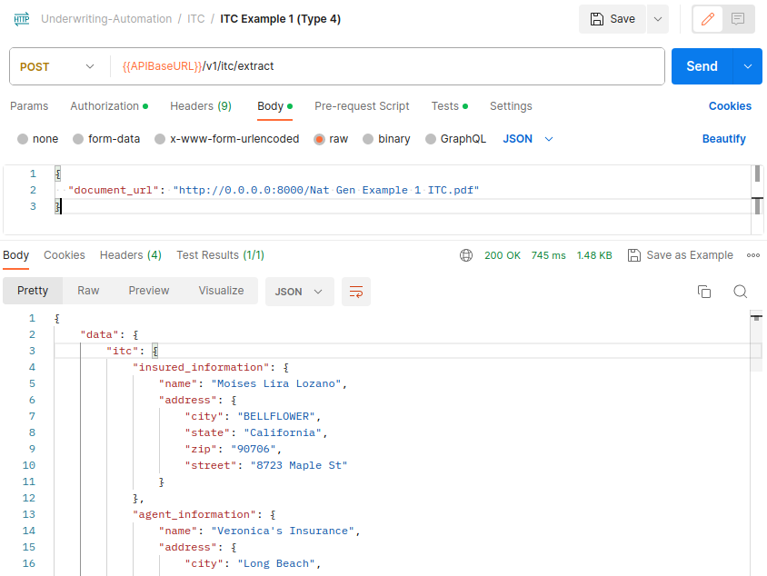

# demo-site-backend

The Demo Site repository contains proof-of-concepts for the Machine Learning Project. Projects like object detection, OCR (Optical Character Recognition), data annotation, and extraction from PDF documents.

## List of POCs currently presented in Demo Site


---

---
1. Driving Licence OCR
2. Certificate Of Title OCR
3. Vehicle Damage Part Detection
4. Answering Machine Detection
5. Veronica's Underwriting Automation
6. Medical Insights Extractor

## Prerequisite 


---

---
- `python == 3.9.x` (Any Patch version would work)
- `tesseract == 5.1.0`
- `sudo apt-get install tesseract-ocr-eng`
- `poppler-utils == 0.86.1` (In Order to run **Documents Insights Extractor** POC, poppler-utils should be installed in development machine. To install and configure poppler-utils please refer following [[link]](https://pdf2image.readthedocs.io/en/latest/installation.html))

## Getting Started 


---

---
1. Clone the repository
```commandline
git clone https://github.com/gitgeekhack/demo-site-backend.git
```

2. pull large files. (if git lfs is not installed please install before running the command [[Link]](https://www.scaler.com/topics/git/git-lfs/))
```commandline
git lfs pull
```
3. Install all the requirements
```commandline
pip install -r requirements.txt
```
4. Run the project
```commandline
python run.py
```

**Note:** Once repository cloned or downloaded, please copy following file `./data/USA Certificate of Title/tesseract_trained_data/five.traineddata` to following location `/usr/share/tesseract-ocr/5/tessdata/` in your development machine.  

## Set Environment Variable Of Tesseract


---

---
- Tesseract engine should be installed in order to OCR the image. To interact with Tesseract using python, tesseract path should be configured. Below command is to used set Tesseract environment variable.
  - #### Ubuntu
    ```commandline
    export Tesseract_PATH=/usr/bin/tesseract
    ```
  - #### Windows
    > To access tesseract-OCR from any location you may have to add the directory where the tesseract-OCR binaries are located to the Path variables, probably **C:\Program Files\Tesseract-OCR**.
    - To set environment variable in Windows machine please refer this [link](https://docs.oracle.com/en/database/oracle/machine-learning/oml4r/1.5.1/oread/creating-and-modifying-environment-variables-on-windows.html)

  
## Veronicas Underwriting Automation


---

---

The folder will contain APIs for underwriting automation
- **CRMReceipt:**
  - Extract: `/api/v1/crm-receipt/extract`
- **ITC**:
  - Extract: `/api/v1/itc/extract`
- **Driving License**:
  - Extract: `/api/v1/driving-license/extract`
- **MVR**:
  - Extract: `/api/v1/mvr/extract`
- **Broker Package**:
  - Extract: `/api/v1/broker-package/extract`
- **Pleasure Use Letter**:
  - Extract: `/api/v1/pleasure-use-letter/extract`
- **Same Person Statement**:
  - Extract: `/api/v1/same-person/extract`
- **Promise To Provide**:
  - Extract:` /api/v1/promise-to-provide/extract`
- **Stripe Receipt**:
  - Extract: `/api/v1/stripe-receipt/extract`
- **VR**:
  - Extract:`/api/v1/vr/extract`
- **Registration**:
  - Extract:`/api/v1/registration/extract`
- **EFT**:
  - Extract:`/api/v1/eft/extract`
- **Artisan Use Letter**:
  - Extract:`/api/v1/artisan-use-letter/extract`
- **Non Owners Letter**:
  - Extract:`/api/v1/non-owners-letter/extract`
- **Application**:
  - Verify: `/api/v1/insurance-application/verify`
  - Extract: `/api/v1/insurance-application/extract`

1. Checkout the folder
```commandline
cd underwriting-automation
```
2. Install all the requirements
```commandline
pip install -r requirements.txt
```
3. Run the project
```commandline
python run_underwriting_automation.py
```

### POSTMAN COLLECTION

---

Please Find the Postman collection in `/demo-site-backend/underwriting-automation/postman-collection`.

Export the postman collection in Postman, Follow the instructions [[link](https://learning.postman.com/docs/getting-started/importing-and-exporting/exporting-data/)]

To run an API in Postman using a Postman collection and environment, you can follow these steps:

1. **Open Postman**: Make sure you have Postman installed on your computer. If not, you can download and install it from [the Postman website](https://www.postman.com/).

2. **Import Collection and Environment**:
   - Click on the "Import" button in Postman.
   - Select the Postman collection file (usually with a .json extension) that you want to import.
   - If there's an environment associated with the collection, also import the environment file.

3. **Start Your Python HTTP Server**:
   - Open a terminal or command prompt.
   - Navigate to the folder where your `run_underwriting_automation.py` and the document file are located.
   - Host a Python HTTP server using the following command:
     ```
     python -m http.server
     ```
   This command will start a simple HTTP server on port 8000, serving files from the current directory.

4. **Prepare Your API Request**:
   - In Postman, create a new request by clicking the "New" button in the top-left corner.
   - Choose the collection you imported in step 2.
   - In the request, set the HTTP method to "POST."

5. **Add Request URL**:
   - In the request URL field, add the URL of your API, which should include the path to the endpoint you want to call.

6. **Set Request Body**:
   - In the request body, select the "raw" option.
   - Choose the body type as JSON (if your API expects JSON data).

7. **Provide JSON Data**:
   - In the body of the request, provide the JSON data you mentioned, including the document URL:
     ```json
     {
       "document_url": "http://0.0.0.0:8000/Nat Gen Example 1 ITC.pdf"
     }
     ```

8. **Send the Request**:
   - Click the "Send" button to execute the request.

9. **Review Response**:
   - Postman will display the response from the API. You can inspect the response body, headers, and other relevant information.

10. **Repeat as Needed**:
    - You can repeat the process with different API endpoints or different data as required by your collection.

That's it! You've successfully run an API in Postman using a collection and environment, and you've hosted a Python HTTP server to serve the document file. This allows you to test your API requests with the specified data.


